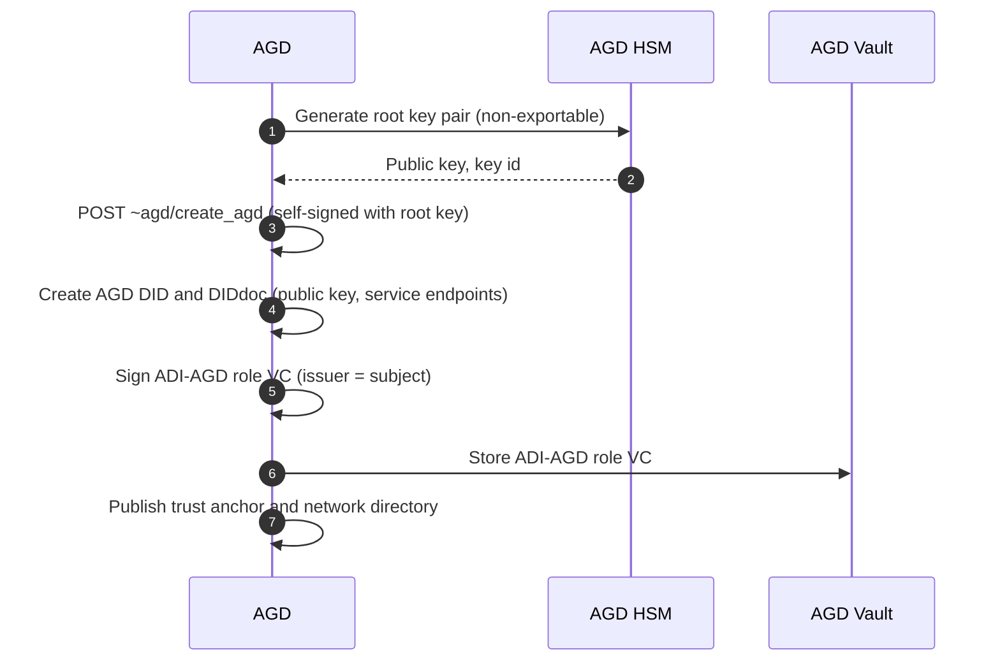

# Figures 11–20 as Mermaid

Drawn to the **corrected** flows. Where a diagram differs from the current PowerPoint, the difference is deliberate and the register ID is noted.

---

## Figure 11. Creating an AGD


*Key generation precedes DID creation (B-203). Issuer equals subject (A-103).*

---

## Figure 12. Enrolling an Interchange

```mermaid
sequenceDiagram
    autonumber
    participant IX as IX Applicant
    participant AGD
    participant VAULT as AGD Vault
    participant DAS as IX DAS
    IX->>IX: Generate key pair; store private key in HSM
    IX->>AGD: POST ~agd/enroll_ix (public key, key id, digital address, enrollment form)
    AGD->>AGD: Vet applicant against governance policy
    AGD->>AGD: Create IX DID and DIDdoc from submitted public key
    AGD->>AGD: Sign ADI-IX role VC (entitlements: Issuer, SP, User)
    AGD->>VAULT: Store ADI-IX role VC
    AGD->>AGD: Add Interchange to network directory
    AGD-->>IX: Return DID, DIDdoc, ADI-IX role VC, directory endpoints
    IX->>DAS: Provision DAS with credential and AGD endpoints
```
*This flow had no prose description in the spec (C-309).*

---

## Figure 13. Enrolling an Issuer

```mermaid
sequenceDiagram
    autonumber
    participant ISSUER as Issuer
    participant IX as Interchange
    participant CI as CI Agent
    participant VAULT as IX Vault
    participant AGD
    ISSUER->>IX: POST ~ix/enroll_issuer (enrollment form)
    IX->>IX: Vet applicant against network policy
    IX->>CI: Provision CI Agent; generate keys in agent HSM
    IX->>IX: Create Issuer DID and DIDdoc
    IX->>CI: POST vc_offer (ADI-ISSUER role VC)
    CI->>CI: Sign issue_vc_token with Issuer private key
    CI-->>IX: issue_vc_token
    IX->>IX: Verify token signer = Issuer DID; sign ADI-ISSUER role VC
    IX->>VAULT: Store ADI-ISSUER role VC
    IX->>AGD: List Issuer in network directory
    IX-->>CI: Return ADI-ISSUER role VC
    CI-->>ISSUER: Notification of successful enrollment
```

---

## Figure 14. Enrolling a Service Provider

```mermaid
sequenceDiagram
    autonumber
    participant SP as Service Provider
    participant IX as Interchange
    participant SPA as SP Agent
    participant VAULT as IX Vault
    participant AGD
    SP->>IX: POST ~ix/enroll_sp (enrollment form)
    IX->>IX: Vet applicant against network policy
    IX->>SPA: Provision SP Agent; generate keys in agent HSM
    IX->>IX: Create SP DID and DIDdoc
    IX->>SPA: POST vc_offer (ADI-SP role VC)
    SPA->>SPA: Sign issue_vc_token with SP private key
    SPA-->>IX: issue_vc_token
    IX->>IX: Verify token signer = SP DID; sign ADI-SP role VC
    IX->>VAULT: Store ADI-SP role VC
    IX->>AGD: List Service Provider in network directory
    IX-->>SPA: Return ADI-SP role VC
    SPA-->>SP: Notification of successful enrollment
```
*The Interchange writes the directory entry, not the SP Agent (D-412).*

---

## Figure 15. Enrolling a User

```mermaid
sequenceDiagram
    autonumber
    actor USER as User
    participant DAA as Device App (DAA)
    participant DAS as IX DAS
    participant CI as CI Agent
    participant UA as Cloud User Agent
    participant AGD
    USER->>DAA: Request enrollment; complete forms; accept T&Cs
    DAA->>DAA: Generate FIDO credential (user verification enrolled)
    DAA->>DAS: POST ~ix/enroll_user (FIDO public key, HIDA if required, forms)
    DAS->>DAS: Check Digital Address uniqueness; verify HIDA per region policy
    opt Interchange outsources identity proofing
        DAS->>CI: Request identity proofing
        CI-->>DAS: Proofing result (IAL)
    end
    DAS->>UA: Provision Cloud User Agent; create vault signing key in HSM
    DAS->>DAS: Create User DID and DIDdoc (binds FIDO key and vault key)
    DAS->>DAS: Sign ADI-USER role VC with Interchange key
    DAS->>UA: Store ADI-USER role VC in user vault
    DAS->>AGD: Register User DID in directory
    DAS-->>DAA: Return Digital Address, DID, ADI-USER role VC
    DAA-->>USER: Enrollment complete
```
*The Interchange issues the User's role credential, not the User Agent (B-202). Keys exist before the DID is created (B-203). The Issuer proofs; it does not issue the role VC (A-107).*

---

## Figure 16. Issuing a VC — High-Level Flow

```mermaid
sequenceDiagram
    autonumber
    participant CI as Credential Issuer
    participant CIA as CI Agent
    participant UA as User Agent
    actor USER as User
    participant VAULT as Vault
    CI->>CIA: make_vc_offer (type, claims, bound subject DID)
    CIA-->>UA: vc_offer (single-use, expires, tx_code)
    UA->>USER: Present offer; request approval
    USER-->>UA: Authenticate on device; approve
    UA->>UA: Sign issue_vc_token with user key (WebAuthn-authorised)
    UA->>CIA: issue_vc_token
    CIA->>CIA: Verify signer = bound subject; sign VC
    CIA->>VAULT: Store VC (issuer or user vault per DIDdoc service)
    CIA-->>UA: Issuance complete
```
*Subject is bound at offer creation, never taken from the redeemer (A-122).*

---

## Figure 17. Issuing a VC — Detailed Flow

```mermaid
sequenceDiagram
    autonumber
    actor USER as User
    participant DAA as Device App (DAA)
    participant UA as Cloud User Agent
    participant CIA as CI Agent
    participant ISS as Issuer
    participant VAULT as Vault
    ISS->>CIA: POST ~issuer/make_vc_offer {vct, claims, adia_subject}
    CIA->>CIA: Create offer: pre-authorized code, tx_code, expiry
    CIA-->>UA: vc_offer (QR / deep link)
    UA->>DAA: Display offer; request consent
    DAA->>USER: Show credential details and tx_code prompt
    USER-->>DAA: Approve; user verification (UV=1)
    DAA-->>UA: WebAuthn assertion, challenge = SHA-256(token payload)
    UA->>UA: Verify assertion; HSM signs issue_vc_token
    UA->>CIA: POST ~issuer/issue_vc {issue_vc_token}
    CIA->>CIA: Verify signature; verify sub = adia_subject; check offer unexpired, unused
    CIA->>CIA: Sign VC (SD-JWT VC with cnf = user key, status reference)
    CIA->>VAULT: Store VC at endpoint from user DIDdoc service, else issuer vault
    CIA-->>UA: Issued; vault location
    UA-->>DAA: Notify user
```
*Signing authorised by a WebAuthn assertion bound to the payload hash (B-206). "Biometric approval" is UV=1 inside the assertion, not a message (B-207).*

---

## Figure 18. Requesting a VC — High-Level Flow

```mermaid
sequenceDiagram
    autonumber
    participant SP as Service Provider
    participant SPA as SP Agent
    participant UA as User Agent
    actor USER as User
    participant VAULT as Vault
    SP->>SPA: Request presentation (accepted types, assurance floor)
    SPA->>UA: vc_request {nonce, aud, exp, schemas_accepted, min_ial, min_aal}
    UA->>USER: Show what is requested; ask consent
    USER-->>UA: Authenticate on device; approve disclosure
    UA->>VAULT: Fetch VC
    VAULT-->>UA: VC
    UA->>UA: Build VP bound to nonce and aud; sign with user key
    UA->>SPA: VP
    SPA->>SPA: Verify per §12.3 (signatures, chain, entitlement, status, assurance)
    SPA-->>SP: Verified claims
```
*Nonce and audience make the presentation non-replayable (A-123).*

---

## Figure 19. Service Provider Requests a VC — Detailed Flow

```mermaid
sequenceDiagram
    autonumber
    participant SP as Service Provider
    participant SPA as SP Agent
    participant UA as Cloud User Agent
    participant DAA as Device App (DAA)
    actor USER as User
    participant VAULT as Vault
    SP->>SPA: Present-credential request for User
    SPA->>UA: POST vc_request {nonce, aud, state, exp, schemas_accepted, min_ial, min_aal}
    UA->>DAA: Request consent; list credentials and claims to disclose
    DAA->>USER: Consent screen
    USER-->>DAA: Approve; select claims; user verification (UV=1)
    DAA-->>UA: WebAuthn assertion, challenge = SHA-256(VP payload)
    UA->>VAULT: Fetch VC and disclosures
    VAULT-->>UA: VC (SD-JWT) and selected disclosures
    UA->>UA: Verify assertion; HSM signs KB-JWT with nonce, aud
    UA->>SPA: VP {SD-JWT VC, disclosures, KB-JWT} + state
    SPA->>SPA: §12.3: nonce/aud match, VP sig, VC sig, cnf, status, chain to AGD, entitlement, assurance, schema
    SPA-->>SP: Verified claims, or rejection with error code
    UA-->>DAA: Presentation delivered
```
*Selective disclosure is real here because the credential is SD-JWT VC (D6, B-215). State correlates the redirect (B-217).*

---

## Figure 20. Service Provider Requests a DID Document

```mermaid
sequenceDiagram
    autonumber
    participant SPA as SP Agent
    participant DAS as IX DAS (of the DID's Interchange)
    SPA->>SPA: Parse DID; identify Interchange
    SPA->>DAS: GET ~ix/did/{id}
    DAS-->>SPA: did_doc {verificationMethod[], service[], proof}
    SPA->>SPA: Verify DIDdoc proof (signed by the enrolling Interchange)
    SPA->>SPA: Select key by kid; DIDdoc is authoritative over role VC copy (B-212)
```
*The DIDdoc response now has a defined shape (B-211).*
